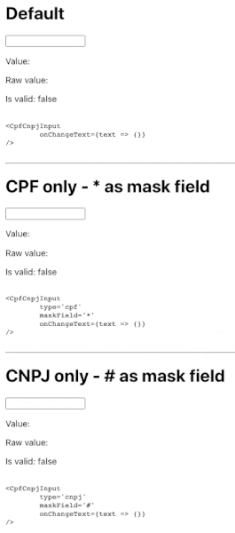

# React CPF/CNPJ Input

This React library allows you to create a text input that accepts, masks and validates a CPF or CNPJ input in real time (as the user types), both on the same field or either one or the other.



CPF and CNPJ are Brazilian person taxpayer number and company registration code, respectively.

It uses [js-brasil](https://npmjs.com/package/js-brasil) for the masking and validation and works as both controlled or uncontrolled input.

[Live Demo](https://jesobreira.github.io/react-cpfcnpjinput)

## Installing

```
npm i react-cpf-cnpj-input
```

## Using

```javascript
import CpfCnpjInput from 'react-cpf-cnpj-input'
```

It inherits all properties from the standard `<input />` tag, so you can set all properties (class, name, id) and events (onClick, onFocus, onChange) you want. But it also offers an "onChangeText" event for better text change handling.

### Properties

Name | Description | Default
---|---|---
type | Accepted input type ("cpf", "cnpj" or "auto"/undefined) | "auto"
maskField | Character to use for representing the fields to type | "_"

### Methods

* **getValue()**: gets input value with masking
* **getRawValue()**: gets input value, numbers only
* **isValid([document])**: returns "cpf" or "cnpj" if the input is valid, or returns true if "document" is specified (as "cpf" or "cnpj") and the value was checked to be valid, otherwise returns simply false for invalid documents

